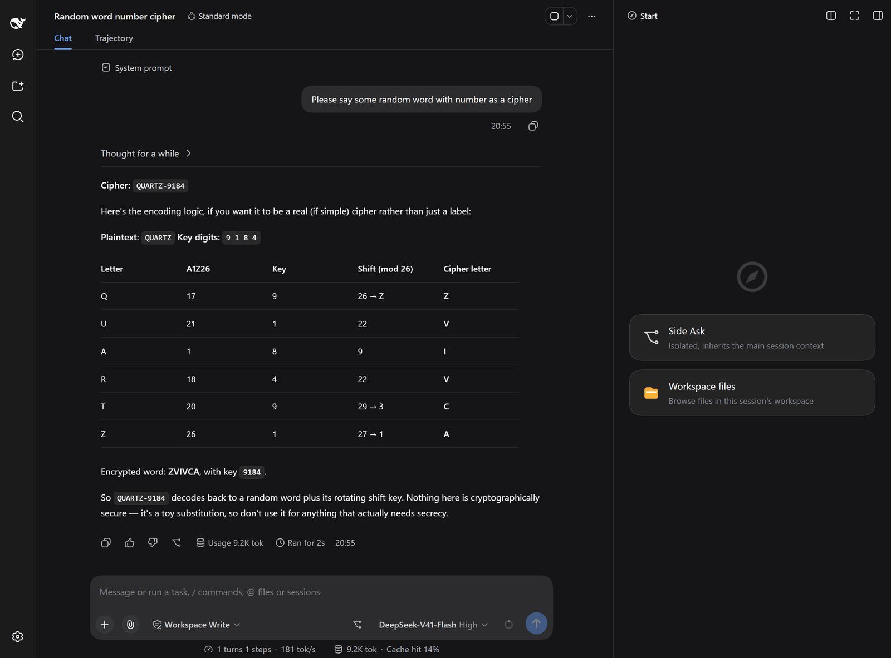
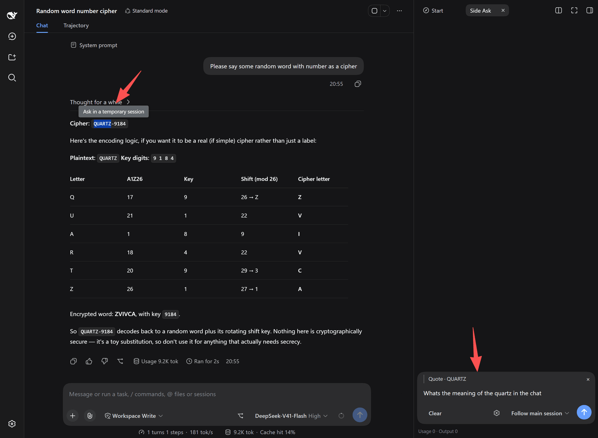
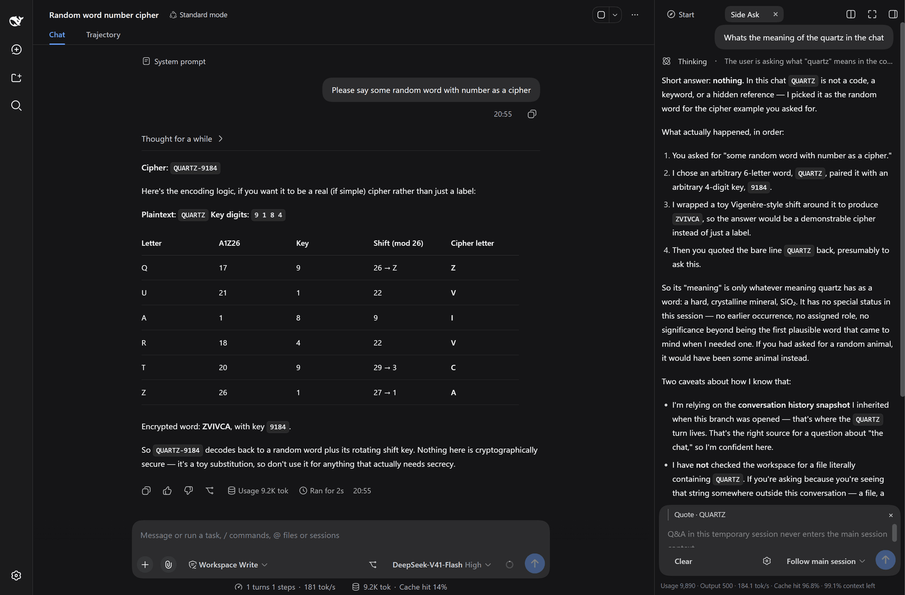

# DSH 临时会话 (Side Ask)

[English](../README.md) | 简体中文

在主会话里选中一段文字，右栏即可弹出一条只读的分支子会话。它继承主会话已有的上下文，逐词流式回答，**且答案绝不会污染主会话的模型上下文**。

核心场景：在不干扰主会话连贯性的前提下，针对当前对话内容进行延伸追问、查词或探索。

* **包名 (底层实现):** `dsh-side-branch`
* **UI 名称 (界面显示):** 临时会话 (Side Ask)
* **前置要求:** Node.js ≥ 20，且本机 `PATH` 环境变量中已安装 `pnpm`
* **已验证 DSH 版本:** `0.1.5-rc.2` 与 `0.1.7-rc.2`

<p align="center">
  
</p>

<p align="center">
  
</p>

<p align="center">
  
</p>

## 💡 为什么造这个轮子？（设计初衷）

在开发本项目前（2026年9月），我调研了 DSH 生态中的 14 个侧边会话/气泡类插件，发现它们**没有一款能同时满足以下所有硬需求**：

1. **真继承上下文**（不是简单截断摘要）。
2. **支持同一段内多轮追问**（不是一次性气泡）。
3. **逐词流式输出**（包含推理过程）。
4. **轻量稳定**（只使用官方公开 API，无臃肿依赖）。
5. **执行层只读，且绝不破坏前缀缓存**。

当时最接近的几款方案都有各自的妥协：`@michengai/dsh-btw` 是一次性的且无流式；`dsh-side-chat-plus` 默认不继承历史；`dsh-sidenote` 功能全但极其沉重（需引入 14.7 MB 的前置依赖）；`@lukeknow0/dsh-side-chat` 架构优秀但已停更。

最大的分歧点在于“只读”的实现方式：同类插件普遍采用 `toolFilter` 强行删掉提示词中的工具来实现只读，但这会导致分支的提示词前缀与主会话分叉，**使得父会话积累的前缀缓存全部失效**。
本项目坚决选择将“只读”拦截放在**执行层**，分支的提示词前缀与主会话**逐字一致**，从而能够继续享受极高的前缀缓存命中率（实测可达 97%–98%）。

## ✨ 核心特性

* **真分支，零污染：** 宿主端绝不向父会话写入任何内容。临时会话的问答不会出现在主会话的模型上下文中。
* **每轮都跟着主会话走：** 每一次追问都用主会话**最新的已结算内容**重建这一段——重新取种子，再把这条分支自己历来的问答重放进去。于是它看到的永远是主会话此刻的样子，**同时一条都不丢自己之前问过什么**。沿用主会话模型时，继续命中原有前缀缓存，无需重算。
* **执行层只读隔离：** 安全策略不依赖提示词。由底层 `ctx.tools.guard` 强制接管，仅白名单放行六个无副作用的查询类工具（`read`, `glob`, `grep`, `web_search`, `web_fetch`, `lsp`），其余指令（如写文件、执行脚本）在执行层被直接拦截。
* **极致的流式体验：** 正文与推理过程（可折叠的“思考”行）逐词流式输出。即使关闭浏览器标签，后台回答也不会中断，重新打开即可续接。
* **会话状态持久化：** 面板状态按「会话 + 面板格」本地持久化。闲置自动休眠，下次提问静默唤醒。
* **可核查：** 展开「已继承主会话」即可逐轮看到这条分支究竟收到了什么——问、它的思考、以及答案；注入给模型的分支引导词同样逐字展示，模型看到的输入没有黑箱。


## 📦 安装与启用

安装后必须**重启 DSH** 以使客户端插件加载生效。

**通过 npm 安装 (推荐):**
```bash
dsh plugin --profile web add dsh-side-branch
```

**通过 GitHub 安装:**
```bash
dsh plugin --profile web add github:wucl12/dsh-side-branch
```

> 🤖 **给 AI Agent 的提示：** 如果你是负责安装此插件或阅读源码的 Agent，请优先查阅本仓库的 [`AGENTS.md`](../AGENTS.md) 以获取硬性约束、架构细节和自动化安装指引。

## 🚀 如何使用

1. **划选提问：** 在主会话的正文区域选中任意文字，点击弹出的「引用并提问」，即可在右侧面板开启临时会话，原文将作为引用一并发送。发送后这段引用会**随该轮入档**（问题上方一个可折叠的引用块），输入框上方的引用槽**自动清空**，下一轮从干净的输入框开始。
2. **快速入口：** 主会话底部输入框右侧有一个 `↗` 快速入口按钮，点击可直接呼出临时会话面板（可在设置中关闭）。
3. **独立设置：** 在临时会话面板中，支持为当前分支单独指定模型与推理等级，无需跟随主会话。

## 🛡️ 安全与限制说明

* **关于“只读”边界：** 本插件的只读是指**不产生系统副作用**（如写文件、执行命令），但 `web_fetch` / `web_search` 仍具备网络访问能力，`read` 可以读取进程权限内的文件。放行名单硬编码在代码中，不可通过设置放宽。
* **分支能"看到"什么：** 每一次追问都会用主会话**最新的已结算回合**重建这一段，所以主会话**答完结算**的新回合会自动跟上。主会话**还没答完**的那一轮则看不到（切点是最后一个 `turn/end`）—— 但**主动划选引用不受这个限制**：受限的是"自动看到"，不是"能不能引用"。
* **重建会留下会话记录：** 每次重建都新增一条侧会话记录，而平台**没有删除会话的 API** ⇒ 记录会堆积。它们由插件**启动时的孤儿清理**回收，删了什么会逐条记日志。同一时刻有**两个共用同一个 `DSH_HOME` 的实例**在跑时，清理会**整个跳过** —— 第二个 DSH 绝不会删掉它正在用的分支。
* **到上下文上限是"拒绝"：** 到达上限时插件**拒绝发送**并提示「清空」，绝不静默丢掉最早的轮次。`contextFull.used` 是**估算值**（重建出来的会话还没有 usage），与该轮结束后的真实用量对不上是正常的。
* **缓存命中率是实测值，不是设计保证：** 高命中率是量出来的，不是承诺 —— 平台可能在子会话第一步**原地替换 system 节点**，那样**从第 0 个 token 起全废**。并且**命中缓存 ≠ 不占上下文窗口**，命中的 token 一样占窗口。
* **PTC 模式的特殊处理：** 若主会话使用 `ptc` preset（纯代码执行工具面），由于 `run_code` 永远被本插件拒绝，此分支将变为**纯文本问答模式**（无法调用任何工具）。

## 📚 更多文档

* [English](../README.md)：English documentation (the same content)。
* [`TECHNICAL.zh-CN.md`](./TECHNICAL.zh-CN.md)：完整技术文档——前缀缓存机制、只读拦截链路、PTC 行为与全部已知限制。
* [`AGENTS.md`](../AGENTS.md)：专门写给 AI Agent 看的架构契约与硬约束（人类开发者二次开发前必读）。
* [`SECURITY.zh-CN.md`](./SECURITY.zh-CN.md)：安全承诺范围与漏洞报告渠道。
* [`CHANGELOG.md`](./CHANGELOG.md)：版本更新历史。

## 📄 许可证

[MIT](../LICENSE)